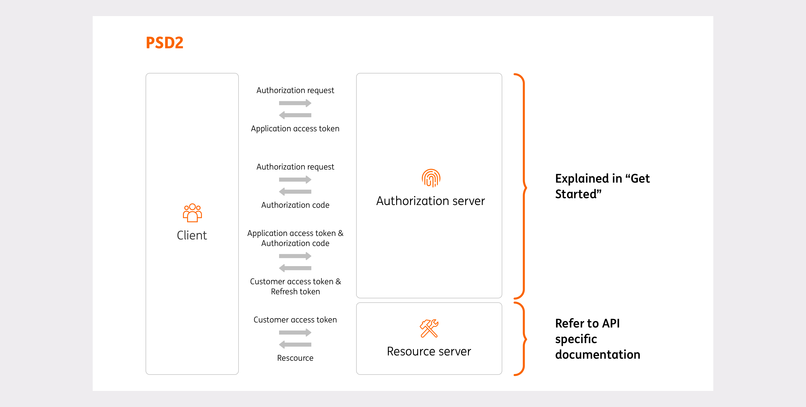

# ING OAuth2 API Client library for Java

NOTE: AT THE MOMENT ONLY THE SANDBOX INTEGRATION (TEST ENVIRONMENT) IS COVERED IN THE PROJECT.

By using this library, you can obtain end-user authorization grants for use with the ING PSD2 APIs.

This page contains information about getting started with the ING PSD2 integration
using the ING API Client library for Java. In addition, you may be interested
in the following documentation:

* Read the [Developer's Guide for the ING Payment Services Directive (PSD2) APIs][developer-portal].
* Check the available APIs in your browser using the [ING APIs Marketplace][api-marketplace].

## Installation

### Maven

Before using the dependency, please run a `mvn clean install` to have the artifact in your local repository.

The project is not published on the public maven repositories.

Add the following lines to your `pom.xml` file:

```xml
<project>
  <dependencies>
    <dependency>
      <groupId>net.danlucian.psd2.ing</groupId>
      <artifactId>oauth2-sdk</artifactId>
      <version>0.0.1-SNAPSHOT</version>
    </dependency>
  </dependencies>
</project>
```

### Gradle

```gradle
dependencies {
  compile 'net.danlucian.psd2.ing:oauth2-sdk:0.0.1-SNAPSHOT'
}
```

## Short introduction

ING has 2 environments which can be used for the integration:
- Production
- Sandbox

The sandbox environment enables you to test the connectivity to ING APIs. It contains a simulator that simulates API responses.

The production environment includes 2 different flows: PSD2 and OpenBaking. The difference between those two flows is that the PSD2 requires a valid eIDAS certificate when executing a request against the APIs and the OpenBanking not.                  

## Sequence diagram



For refering to specific API documentation, please check the [ING APIs Marketplace][api-marketplace].

## Get started with the sandbox

1. Create a ClientSecrets instance and load your certificates:

```java
final ClientSecrets clientSecrets = new ClientSecrets(
                clientCertificate,
                clientKey,
                signingCertificate,
                signingKey);
```

2. Define your desired scopes (if you don't have any scope, go directly to the step 7):

```java
final String scopes = "customer-details%3Aprofile%3Aview+customer-details%3Aemail%3Aview+customer-details%3Aaddress%3Aview";
```

3. Instantiate a sandbox flow:

```java
Flow sandBoxFlow = new SandboxAuthorizationFlow(clientSecrets, scopes);
```

4. Get an application access token:

> Important! Please note that the application access token expires after 900 seconds after which you need to execute this step again in order to re-authenticate your application and request a new application access token. It is advisable to re-use the application access token instead of requesting a new token for each API call.

```java
ApplicationAccessToken applicationAccessToken = sandBoxFlow.getAppAccessToken();
```

5. Get a granting url:

```java
PreflightUrl preflightUrl = sandBoxFlow.getPreflightUrl(
                applicationAccessToken,
                new URL("https://www.ing.ro"),
                Country.Romania
);
```

6. Get a customer access token:

```java
CustomerAccessToken customerAccessToken = sandBoxFlow.getCustomerAccessToken(
                applicationAccessToken,
                "result-of-preflight"
);
```

7. Get only an application access token without having to define also the scopes:
```java
AppAccessTokenClient appAccessTokenClient = new AppAccessTokenClient(clientSecrets);
ApplicationAccessToken applicationAccessToken = appAccessTokenClient.getToken();
```

## Get started with the open banking flow
1. Create a ClientSecrets instance and load your certificates:

```java
final ClientSecrets clientSecrets = new ClientSecrets(
                clientCertificate,
                clientKey,
                signingCertificate,
                signingKey);
```

2. Get an application access token:

> Important! Please note that the application access token expires after 900 seconds after which you need to execute this step again in order to re-authenticate your application and request a new application access token. It is advisable to re-use the application access token instead of requesting a new token for each API call.

```java
AppAccessTokenClient appAccessTokenClient = new AppAccessTokenClient(clientSecrets);
ApplicationAccessToken applicationAccessToken = appAccessTokenClient.getToken();
```

## Get started with the PSD2 flow

Under development...

### Pre-requisite to consume PSD2 APIs in the production environment

- You must be registered with a National Competent Authority (NCA, or Regulator) as Account Information Service Provider (AISP) and/or Account Servicing Payment Service Providers (ASPSP) and/or Payment Initiation Services Provider (PISP).
- You must have the PSD2 eIDAS certificates.

[developer-portal]: https://developer.ing.com/openbanking/get-started/psd2
[api-marketplace]: https://developer.ing.com/api-marketplace/marketplace
